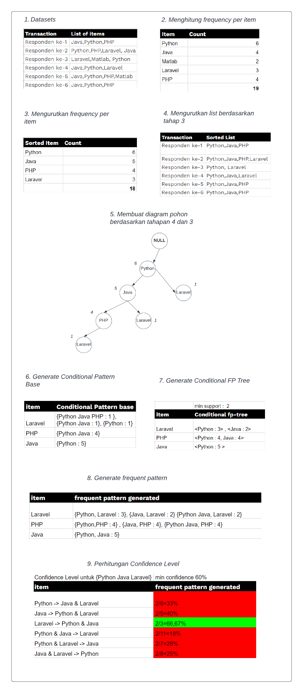

# Algoritma FP Growth
Merupakan teknik penemuan pola hubungan menggunakan dengan membangun sebuah struktur data yang sangat padat (FP-tree) untuk kompres database transaksi asli. Algoritma ini  menyimpan berbagai informasi mengenai data yang paling sering muncul dalam bentuk struktur prefix-tree atau bisa disebut dengan FP-Tree.

Dapat dikatakan bahwa FP Growth merupakan pengembangan dari Apriori. Perbedaan utamanya adalah FP Growth menggunakan *data real* untuk menemukan pola hubungan, Sedangkan Apriori menggunakan *data real dan data bangkitan* juga semua kemungkinan pasangan itemsets lainnya. 

# Flow
1. pembentukan conditional pattern base
2. pembentukan conditional pattern tree 
3. perhitungan frequent itemset

## Terminologi
- antecedents : Jika rule yang terbentuk adalah A -> B, maka A disebut antecedents
- consequents : Jika rule yang terbentuk adalah A -> B, maka B disebut consequents
- support : menunjukkan berapa kali suatu item muncul dalam basis data transaksi
- confidence : ukuran yang menunjukkan hubungan antar 2 item secara conditional
- lift : nilai yang mengukur besarnya hubungan antara antecedent dan consequent yang tidak saling bergantung (independent). Lift memiliki range mulai dari 0 sampai dengan ∞. Nilai yang mendekati 1 mengindikasikan bahwa antecedent dan consequent tidak memiliki ketergantungan. Nilai yang jauh dari 1 mengindikasikan bahwa antecedent menyediakan informasi tentang consequent. 
- leverage : nilai yang mengukur banyaknya item antecedent dan consequence yang dijual secara bersamaan dalam suatu data set yang lebih dari yang diharapkan. Nilai 0 menunjukkan antecedent dan consequent independent. 
- conviction : nilai yang tinggi berarti konsekuensinya sangat tergantung pada anteseden. Misalnya, dalam kasus skor Conviction sempurna, hasilnya menjadi 0 (karena 1 - 1) di mana skor Conviction didefinisikan sebagai 'inf'. Mirip dengan lift, jika item independen, conviction adalah 1.

## Formula

#### Support
$$ \text{support}(A) = \frac{\text{frequency}(A)}{\text{N}}, \text{support}(A\rightarrow B) = \frac{\text{frequency}(A\cup B)}{\text{N}}, \text{range: } [0, 1] $$

#### Confidence
$$ \text{confidence}(A\rightarrow B) = \frac{\text{support}(A\rightarrow B)}{\text{support}(A)},  \text{range: } [0, 1] $$  

#### Lift
$$ \text{lift}(A\rightarrow B) = \frac{\text{confidence}(A\rightarrow B)}{\text{support}(B)},  \text{range: } [0, \infty] $$  

#### Leverage
$$ \text{leverage}(A\rightarrow B) = \text{support}(A\rightarrow B) - \text{support}(A) \times \text{support}(B), \text{range: } [-1, 1] $$  

#### Conviction
$$ \text{conviction}(A\rightarrow B) = \frac{1 - \text{support}(B)}{1 - \text{confidence}(A\rightarrow B)}, \text{range: } [0, \infty] $$ 

## Reference
1. http://repository.unmuhjember.ac.id/5671/11/j.%20JURNAL.pdf
2. https://media.neliti.com/media/publications/65360-ID-implementasi-algoritma-fp-growth-untuk-s.pdf
3. https://www.softwaretestinghelp.com/fp-growth-algorithm-data-mining/
4. https://prpm.trigunadharma.ac.id/public/fileJurnal/hpqZ6%20Ali%20Ikhwan%20.pdf